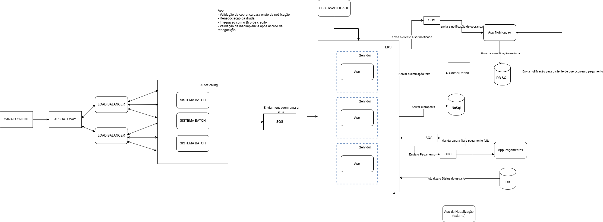

# Aplicação de Notificação

## Descrição
Essa é uma aplicação que recebe um usuario que precisa ser notificado em caso de ter uma conta vencida

## O que é necessário para rodar
## Instalação do AwsLocalStack
## Java 17

## Instrução de Uso

1. Será necessário criar uma fila SQS com o nome : fila-appNotification
2. Comando para criar: awslocal sqs create-queue --queue-name fila-appNotification

## System Design

